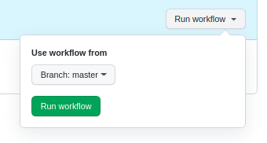
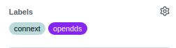

# dds-rtps

Validation of interoperability of products compliant with
[OMG DDS-RTPS standard](https://www.omg.org/spec/DDSI-RTPS/).
This is considered one of the core
[DDS Specifications](https://www.dds-foundation.org/omg-dds-standard/).
See https://www.dds-foundation.org/ for an overview of DDS.

The executables found on the
[release tab of this repository](https://github.com/omg-dds/dds-rtps/releases)
test discovery, DDS Topic and QoS matching, and interoperability for different
QoS settings. The goal is to validate that the implementations perform
these functions in compliance with OMG DDS-RTPS standard
and can interoperate with each other.

## Table of contents

* 1\. [Introduction](#introduction)
    * 1.1. [Vocabulary](#vocabulary)

* 2\. [Test Suite](#test-suite)

* 3\. [Run Interoperability Test Manually](#run-interoperability-test-manually)
    * 3.1. [Requirements](#requirements)

      * 3.1.1. [Using virtual environments](#using-virtual-environments)

        * 3.1.1.1. [Create virtual environment](#create-virtual-environment)

        * 3.1.1.2. [Activate virtual environment](#activate-virtual-environment)

        * 3.1.1.3. [Install requirements](#install-requirements)

    * 3.2. [Options of interoperability_report](#options-of-interoperability_report)

    * 3.3. [Example of use interoperability_report](#example-of-use-interoperability_report)

    * 3.4. [Report](#report)

* 4\. [Automation with GitHub Actions](#automation-with-github-actions)

* 5\. [Workflow](#workflow)

    * 5.1. [Create executable](#create-executable)

    * 5.2. [Upload executable](#upload-executable)

    * 5.3. [Create a new release](#create-a-new-release)

      * 5.1.1. [Release and tag name](#release-and-tag-name)

      * 5.1.2. [When to create a release](#when-to-create-a-release)

      * 5.1.3. [Process of creating the release](#process-of-creating-the-release)

    * 5.4. [Report Bugs](#report-bugs)

# Introduction

In order to test the interoperability between different DDS implementations, a
DDS application is used. This application is `shape_main`. The `shape_main`
application adds a big variety of options to modify several parameters it uses,
such as the topic name, the kind of entity (publisher/subscriber), includes
DDS QoSes... The `shape_main` application is built statically with different
DDS implementations and those executables are tested between them to check
their interoperability with different parameter sets defined in a Test Suite.
This is done by the `interoperability_report.py` script.

This repository contains a Test Suite `test_suite.py` with all different
Test Cases that the `interoperability_report.py` performs. The user may create
different Test Suites for other testing scenarios or add new Test Cases to the
mentioned Test Suite.

Additionally, the `interoperability_report.py` generates a JUnit report after
its execution showing the results of the different tests performed.

You can run the script `interoperability_report.py` either
[automatically](#automation-with-github-actions)
or [manually](#run-interoperability-test-manually).

## Vocabulary

* Test Suite: this is a Python file that contains different Test Cases.
* Test Case: this is the definition of one testing scenario. This is composed
by a set of parameters that the `shape_main` application will use to test the
interoperability between two `shape_main` applications.
* `shape_main` application: this is a static-linked DDS application that has
several parameters to configure different QoS and other DDS functionality
(such as the Topic Name, color filter, domain, partition,
data representation, etc).
* `interoperability_report.py`: this is the script that runs the different
Test Cases within a Test Suite and generates a report with the results.

# Test Suite

In order to create a Test Suite we must define it in a python file,
following the next pattern:

~~~python
# The Test Suite is a dictionary where each element
# is a Test Case that interoperability_report.py
# executes.
# The dictionary has the following structure:
#       'name' : [[parameter_list], [expected_return_code_list], function]
# where:
#   * name: TestCase's name
#   * parameter_list: list in which each element is the parameters that
#         the shape_main application will use.
#   * expected_return_codes: list with expected ReturnCodes for
#     a succeed test execution.
#   * expected_return_code_list: list with expected ReturnCodes
#         for a succeed test execution.
#   * function [OPTIONAL]: function to check how the Subscribers receive
#         the samples from the Publishers. By default, it just checks that
#         the data is received. In case that it has a different behavior, that
#         function must be implemented in the test_suite file and the test case
#         should reference it in this parameter.
#
#     The function must have the following parameters:
#     child_sub: child program generated with pexpect
#     samples_sent: list of multiprocessing Queues with the samples
#                the Publishers send. Element 1 of the list is for
#                Publisher 1, etc.
#     timeout: time pexpect waits until it matches a pattern.

#   The number of elements in parameter_list defines how many shape_main
#   applications the interoperability_report will run. It should be the same as
#   the number of elements in expected_return_code_list.

# Example

rtps_test_suite_1 = {
  # one publisher with parameters [-t Square -x 2] and one subscriber with
  # [-t Square -c RED -x 2]. The publisher expected return code is OK
  # and the subscriber, DATA_NOT_RECEIVED
  'Test_Color_7' :  [['-P -t Square -x 2', '-S -t Square -c RED -x 2'],
                    [ReturnCode.OK, ReturnCode.DATA_NOT_RECEIVED]],
  # two publishers and one subscriber, all of them with expected return codes OK.
  'Test_DataRepresentation_0' : [['-P -t Square -x 1', '-P -t Square -x 1', '-S -t Square -x 1'],
                                [ReturnCode.OK, ReturnCode.OK, ReturnCode.OK]],
}
~~~

By default, the `interoperability_report.py` script runs the tests from
`test_suite.py` in its same directory. The Test Suites defined **must** be
located in the same directory as `interoperability_report.py`.

## `shape_main` application parameters

The `shape_main` application allows the following parameters:

~~~
   -d <int>        : domain id (default: 0)
   -b              : BEST_EFFORT reliability
   -r              : RELIABLE reliability
   -k <depth>      : keep history depth (0: KEEP_ALL)
   -f <interval>   : set a 'deadline' with interval (seconds)
   -i <interval>   : apply 'time based filter' with interval (seconds)
   -s <int>        : set ownership strength [-1: SHARED]
   -t <topic_name> : set the topic name
   -c <color>      : set color to publish (filter if subscriber)
   -p <partition>  : set a 'partition' string
   -D [v|l|t|p]    : set durability [v: VOLATILE,  l: TRANSIENT_LOCAL]
                                     t: TRANSIENT, p: PERSISTENT]
   -P              : publish samples
   -S              : subscribe samples
   -x [1|2]        : set data representation [1: XCDR, 2: XCDR2]
   -w              : print Publisher's samples
   -z <int>        : set shapesize (between 10-99)
   -v [e|d]        : set log message verbosity [e: ERROR, d: DEBUG]

~~~

# Run Interoperability Test Manually

## Requirements

- Python 3.8+
- Create and enable a virtual environment (installing requirements)

### Using virtual environments

The build will be done using virtual environments, you should create and
activate the virtual environment and then install all dependencies. This can be
done by following these steps:

#### Create virtual environment

In Linux® systems, you may need to install the corresponding python `venv`
package:

```
sudo apt install python3.8-venv
```

To create the virtual environment:

```
python3 -m venv .venv
```

#### Activate virtual environment

```
source .venv/bin/activate
```

#### Install requirements

This step is only required the first time or when the requirements change:

```
pip install -r requirements.txt
```
## Options of interoperability_report

The `interoperability_report.py` may configure the following options:

```
$ python3 interoperability_report.py -h

usage: interoperability_report.py [-h] -P publisher_name -S subscriber_name
                                  [-v] [-s test_suite_dictionary_file]
                                  [-t test_cases [test_cases ...] | -d
                                  test_cases_disabled
                                  [test_cases_disabled ...]] [-o filename]

Validation of interoperability of products compliant with OMG DDS-RTPS
standard. This script generates automatically the verification between two
shape_main executables. It also generates an XML report in JUnit format.

optional arguments:
  -h, --help            show this help message and exit

general options:
  -P publisher_name, --publisher publisher_name
                        Path to the Publisher shape_main application. It may
                        be absolute or relative path. Example: if the
                        executable is in the same folder as the script: "-P
                        ./rti_connext_dds-6.1.1_shape_main_linux".
  -S subscriber_name, --subscriber subscriber_name
                        Path to the Subscriber shape_main application. It may
                        be absolute or relative path. Example: if the
                        executable is in the same folder as the script: "-S
                        ./rti_connext_dds-6.1.1_shape_main_linux".

optional parameters:
  -v, --verbose         Print debug information to stdout. This option also
                        shows the shape_main application output in case of
                        error. If this option is not used, only the test
                        results are printed in the stdout. (Default: False).

Test Case and Test Suite:
  -s test_suite_dictionary_file, --suite test_suite_dictionary_file
                        Test Suite that is going to be tested. Test Suite is a
                        file with a Python dictionary defined. It must be
                        located on the same directory as
                        interoperability_report. This value should not contain
                        the extension ".py", only the name of the file. It
                        will run all the dictionaries defined in the file.
                        (Default: test_suite).
  -t test_cases [test_cases ...], --test test_cases [test_cases ...]
                        Test Case that the script will run. This option is not
                        supported with --disable_test. This allows to set
                        multiple values separated by a space. (Default: run
                        all Test Cases from the Test Suite.)
  -d test_cases_disabled [test_cases_disabled ...], --disable_test test_cases_disabled [test_cases_disabled ...]
                        Test Case that the script will skip. This allows to
                        set multiple values separated by a space. This option
                        is not supported with --test. (Default: None)

output options:
  -o filename, --output-name filename
                        Name of the xml report that will be generated. If the
                        file passed already exists, it will add the new
                        results to it. In other case it will create a new
                        file. (Default:
                        <publisher_name>-<subscriber_name>-date.xml)
```


## Example of use interoperability_report

This is an example that runs the `interoperability_report.py`
with the test suite `test_suite.py`

```
$ python3 interoperability_report.py -P <path_to_publisher_executable>
-S <path_to_subscriber_executable>
```

## Report

The script generates a report file in JUnit (xml).

> **Note**: to visualize the report in a more friendly way
you can use `junit-viewer`: \
> `junit-viewer --results=<xml_name> --save=<html_name>`

The report file contains the following items:
* **Test Suites**
    * The headers inside the report.
    * They have some items:
        * Name: `<publisher>--<subscriber>`
        * Time: time spent in the execution of all the Test Cases
          inside the Test Suite.
        * Total error tests :x: : number of Test Cases with
          errors in the Test Suite.
        * Total success tests :heavy_check_mark: : number of
          successful Test Cases in the Test Suite.
        * A set of Test Cases.
* **Test Cases**
    * Test that we are testing.
    * They are green :heavy_check_mark: (success) or red :x: (failure).
    * They have some items:
        * Name
        * Time: time spent in the execution of the Test Case.
        * Parameters Publisher/Subscriber
        * In case of error:
            * Expected code and code produced
            * Console output from the shape application publisher
            and subscriber.

# Automation with GitHub Actions

GitHub Actions allows to automate the testing phase by calling
`interoperability_report.py` and generating the report. Although
this process has to be launched manually by the user.
GitHub Actions take care of unzipping the different executables
that are part of the latest release and run all the combinations of
the executables. For example, if we have 3 executables (A, B and C)
the following tests are performed, the left-side executable is a
publisher application and the right-side executable a subscriber
application:
* A-A
* A-B
* A-C
* B-A
* B-B
* B-C
* C-A
* C-B
* C-C

The GitHub Actions process must be launched in the following cases:
  * Whenever a new executable is uploaded
  * When `interoperability_report.py` changes
  * When `test_suite.py` changes

To generate the report you should follow the next steps:
1. Go to *Actions*.


2. Go to *Testing Interoperability*.


3. Press *Run workflow*, select master branch (for the official tests).



4. Wait a few minutes until the new task is finished and then press it.\
Example of a successful and a failed test:


5. At the bottom of the page you can find the attached artifacts
in the **Artifacts** section that contains the generated report.


6. Download and unzip it. There is file called `index.html`, inside
`report.zip` that is the generated report. It will look something like this
(set pretty option):


> **Note**: The status of the GitHub Action will be **Failure** :x:,
if any of the Test Cases that we are testing has an error,
or **Success** :heavy_check_mark: if none of them reported any error.

# Workflow

This section explains which are the events you may find in the process
of maintaining the repository.

## Create executable

New executables should be created and uploaded to the corresponding
release when:

* A new release of the product (DDS implementation)
* When `shape_main.cxx` changes. In this case, there will be a new
  release version in GitHub. New executables must be created with
  these changes.

The steps to compile with `shape_main.cxx` are not defined but
there are some `makefiles` to help you with the task in the `srcCxx` folder.

For example, if you want to build `shape_main.cxx` with RTI Connext,
you can use `makefile_rti_connext_dds_linux`.

## Upload executable

Each vendor should compile `shape_main.cxx` with their own product.
The executable created **must** follow the following pattern:
`<product_name_and_version>_shape_main_linux` and compress it
into a `.zip` file.

Example:


Then, the executable should be uploaded to the corresponding release:

> **Note**: to do it with the command line see `gh release`

1. In the main page, go to *Releases*.


2. Inside the latest release, go to *Edit*.


3. Upload the executables in *Attach binaries by dropping them here or
selecting them* (leave all the other fields as they were).
Keep marked *Set as the latest release*, and press *Update release*.


> **Note**: once the executable is uploaded, the user should run
> GitHub Actions to generate a new report.
See [Automation with GitHub Actions](#automation-with-github-actions)
for further information.

## Create a new release

### Release and tag name

The name of the release and the tag associated with it will be the same.
It should follow the next rule: \
`vx.y.z`
* x: major version
* y: minor version
* z: year

Whenever there are changes that affect functionality, the major
or minor versions should be updated:
* New functionality, major change -> major version
* Bug fix or new functionality, minor change -> minor version


> Example: actual name -> `v1.0.2022`
> * If there is a small change in the repository: `v1.1.2022`
> * If there is a big change in the repository: `v2.0.2022`
> * At the beginning of a new year: `v1.0.2023`
>   * If last release was `v1.2.2022`, it would be `v1.2.2023`

### When to create a release

There are two cases when we will create a new release:

* Once a year
    A new release is created every year, updating the latest version of all
    executables. This increases the year in the release name and tag.
    * Before creating the release, it's required to:
        * Generate a report (see
          [Automation with GitHub Actions](#automation-with-github-actions)).
        * Upload the report generated as an asset to the current release
          (see [Upload executable](#upload-executable)
          and follow the same steps but with the report file).
* When there is a new functionality in `shape_main.cxx`,
 `interoperability_report.py`, or the creation of any other file that
 could be considered as a new functionality. This increases the
 major or minor version in the release name/tag but no the year.

Every time we create a new release we need to select which executables
we want to maintain in the new release. This new release should contain
the last version uploaded for every vendor.
The executables could also be uploaded (or removed) later.

### Process of creating the release

The automatic test only work with the latest release, so it is important
to keep it up-to-date. Also, the release cannot be set as a pre-release.
Here it is explained how to create the release with the graphic interface.

> **Note**: to do it with the command line see `gh release`.
> You also need to create the tag first. In order to do it:
> ~~~
> git checkout master
> git tag <tag_name>
> ~~~

The name of the release and the tag should be as explained in
[Release and tag name](#release-and-tag-name).

1. In the main page, go to *Releases*.


2. Go to *Draft a new release*.


3. Do:
    * In *Choose a tag* write the name of the tag and select
    *Create a new tag*.
    * Write the release name on *Release title*.
    * In *Describe this release* write: 'Creating release `<name_release>`'.
    * Attach the executables in *Attach binaries by dropping them here or
      selecting them* (you can perform this step later: see
      [Upload executable](#upload-executable)).
    * Mark *Set as the latest release*.
    * Make sure *Set as pre-release* is **not selected**.
    * Press *Publish release*.


## Report Bugs

In case of failure in any of the Test Cases, the vendors involved should
check first that the problem found is not generated by their executables.
If the cause of the problem is not known or it is believed to be generated
by other executables, they should report the problem as an issue
in the following way.

* Go to *Issues*.


* **Check the issue is not already submitted**.
* Select *New Issue*.


* Select Interoperability issue template, *Get Started*.


* Fill out the corresponding information:
    * Title: `Problem with <QoS or parameter>`
    * Fill the fields (publisher and subscriber name, Test Suite,
      Test Case, expected codes and produced codes).
    * Copy the link to the GitHub Action workflow run.
        * Example, from this page:

        

    * Add any suggestion about how to fix it, or why
      this is happening [Optional].
    * Add another comment [Optional].
    * In the section *Labels*, assign them to the vendors involved.

   
   

    * Press *Submit new issue*.

    
