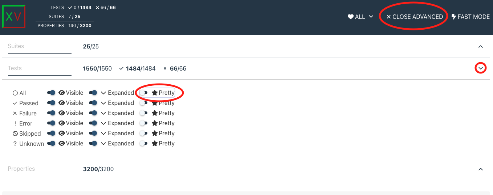

.. include:: vars.rst

.. _section-detailed-report:

Detailed Report
===============

This test report displays individual test results for all products regarding
DDS interoperability. By default, it only shows test suites containing
tests with errors. For each test, the report includes detailed information
about the test case. If the test has failed, it also shows the observed error
and the corresponding program output.

|br|

.. raw:: html

    
Using the Detailed Report

|br|

To display all test suites, click on ``Advanced Filter`` / ``Suites`` /
``Empty hidden``. As shown in the image:

|br|

.. image:: _static/img/show_all_test_suites.png
   :alt: Show All Tests
   :align: center

|br|

The name of the test suite contains two product names separated by 3 dashes. It
represents the product used as a **Publisher** (on the left) and the
product used as a **Subscriber** (on the right):

  * \<publisher_product_name\>\-\-\-\<subscriber_product_name\>

|br|

By default, in case of an error in a test case, the |SHAPE_APP| output is shown
as raw HTML code. You can enable a pretty print of that text by clicking the
``</>raw`` button. However, you may want to enable this option for all test output
by clicking the option ``</>raw`` in ``Advanced Filter`` / ``Tests`` / ``All`` row.

|br|

|br|

.. raw:: html

    
Detailed Report HTML

|br|

The following section is the HTML report that you can interact with:

|br|

.. raw:: html
   :file: |INDEX_HTML_PATH|
