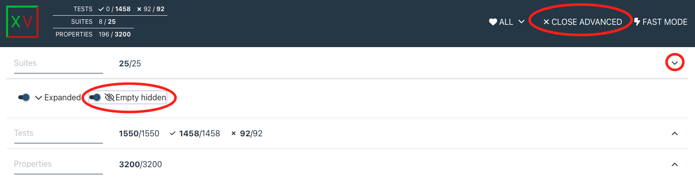

.. include:: vars.rst

.. _section-detailed-report:

Detailed Report
===============

This test report displays the individual test results for all products regarding
DDS interoperability. By default, it only shows the test suites that contain
tests with errors. For each test, the report includes detailed information about
the test case. If the test has failed, it also shows the observed error, and the
corresponding program output.

|br|

In order to show all test suites, you have to click on the 'Advanced Filter' /
'Suites' / 'Empty hidden'. As shown in the image:

|br|

|br|

The name of the test suite contains two product names separated by 3 dashes. It
represents the product used as a publisher (element at the left) and the product
used as a subscriber (right side):

  * \<publisher_product_name\>---\<subscriber_product_name\>

|br|

Detailed report:

|br|

.. raw:: html
   :file: |INDEX_HTML_PATH|
